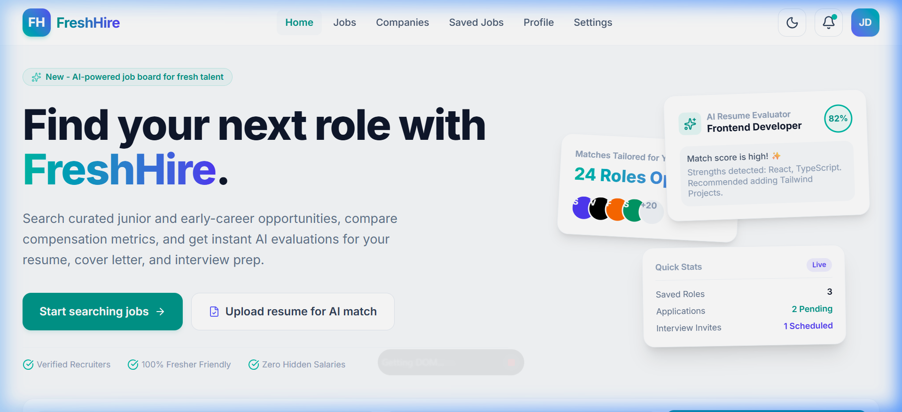
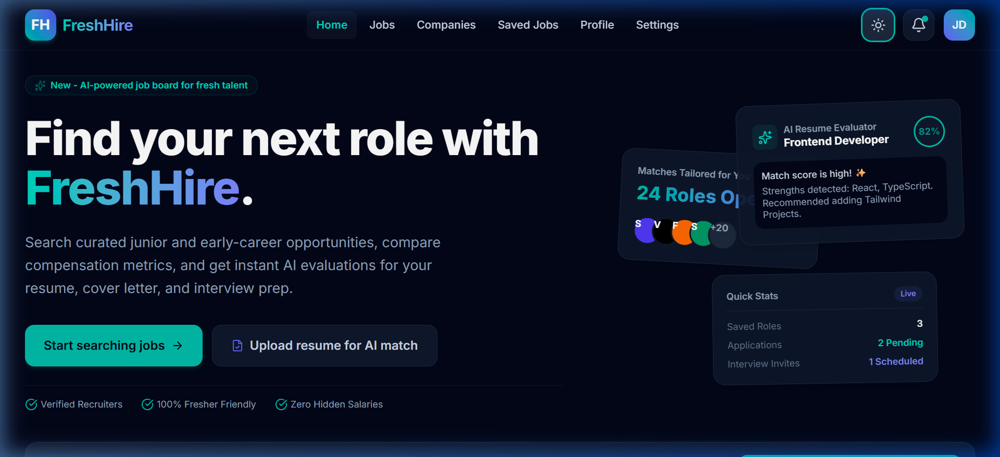
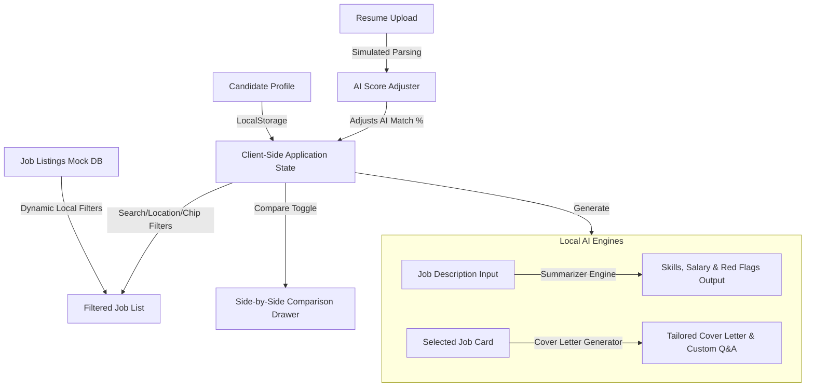

# FreshHire - AI-Powered Job Matching Platform for Freshers

**FreshHire** is a modern, high-fidelity web application built for entry-level developers and early career professionals. It simplifies the job hunting process by utilizing AI-powered matching percentages, direct resume comparisons, and productivity-boosting AI tools like job summarization, cover letter drafting, and interview question generators.

---

## 📸 Preview Screenshots of Homepage

FreshHire features a sleek, premium, fully responsive interface that supports both Light and Dark themes.

### Light Mode


### Dark Mode


---

## 🏗️ System Architecture & Data Workflows

FreshHire operates as a modern client-side Single Page Application (SPA). All state transformations, calculations, and AI responses are handled within the client context and persisted via browser storage.

### Data Workflows Diagram



### Key Workflow Explanations

1. **AI Match Engine**: Each job contains a baseline AI Match rating based on candidate preferences. When a candidate uploads their resume, the frontend triggers a score adjustment calculator (`useMemo`), matching tags like "React", "TypeScript", or "AI" with resume profiles to dynamically bump compatibility rates up to 99%.
2. **AI Job Summarizer & Red Flag Detector**: Reads the pasted job description details locally and instantly separates them into key skills, estimated market salary rates, list of duties, and a crucial "Red Flag" analyzer (which alerts developers to warnings like high pressure, legacy migration projects, or unrealistic expectations).
3. **AI Cover Letter & Interview Prep Generator**: Merges the current active profile data (name, title, location) with the specific selected job details to write custom-fit cover letters and curate mock technical interviews containing role-relevant questions.
4. **Local Storage Synchronization**: Toggles dark mode, saves active job bookmarks, holds custom profile details (e.g., name, current location, target title), and preserves preferences (email alerts, recruiter messages, weekly updates) directly inside browser LocalStorage.

---

## ✨ Features

- **🎯 Interactive AI Match Score**: Instantly ranks jobs from top companies with an AI-compatibility percentage tailored to the candidate's profile.
- **📑 Resume Match Simulation**: Simulates the parsing of an uploaded PDF/DOCX resume, dynamically adjusting compatibility match percentages in real-time.
- **🔍 Advanced Search & Chip Filters**: Search by keyword or location, or apply one-click filters like "Fresher friendly", "Remote", "Hyderabad", "Frontend", "Backend", and "Data".
- **⚖️ Side-by-Side Comparison Drawer**: Select and compare up to three jobs simultaneously across criteria like salary, location, and key requirements.
- **📝 Local AI Job Summarizer**: Extracts essential skills and highlights potential "Red Flags" in job descriptions.
- **✉️ Cover Letter & Interview Q&A Generator**: Drafts complete cover letters and generates customized preparation questions with copy-to-clipboard functionality.
- **👤 Profile & Settings Panel**: Edit candidate details and customize alert preferences with automatic LocalStorage persistence.
- **🌓 Adaptive Dark/Light Mode**: Seamless dark and light themes that respect system-level preferences and save theme selections.

---

## 🛠️ Tech Stack

- **Framework**: [React 19](https://react.dev/)
- **Build Tool**: [Vite 8](https://vite.dev/)
- **Language**: [TypeScript](https://www.typescriptlang.org/)
- **Styling**: [Tailwind CSS v4](https://tailwindcss.com/)
- **Icons**: [Lucide React Icons](https://lucide.dev/)
- **Development Linters**: [Oxlint](https://oxc.rs/)

---

## 📁 Folder Structure

```
FreshHire/
├── public/                 # Static assets served directly
│   ├── screenshots/        # Home page preview screenshots (light_mode.png, dark_mode.png)
│   ├── favicon.svg         # Browser tab favicon
│   └── icons.svg           # Project SVG icon assets
├── src/                    # Main application code
│   ├── assets/             # Core images (hero.png, react.svg, vite.svg)
│   ├── components/         # Reusable frontend layout components
│   │   └── HomePage.tsx    # Single-page interface containing layout, logic, & states
│   ├── App.css             # Main styling overrides
│   ├── App.tsx             # Root React App component (renders HomePage)
│   ├── index.css           # Global CSS stylesheet importing Google Fonts & Tailwind CSS v4
│   └── main.tsx            # Application entrypoint attaching React to the DOM
├── .gitignore              # Ignored files in git tracking
├── .oxlintrc.json          # Oxlint linter compiler rules
├── index.html              # HTML shell template
├── package.json            # Scripts, project meta, and dependency list
├── tsconfig.json           # Root TypeScript compiler rules
├── tsconfig.app.json       # Frontend application specific compiler flags
├── tsconfig.node.json      # Node/Vite specific compiler config
└── vite.config.ts          # Vite build plugin and Tailwind config
```

---

## ⚙️ Setup

Ensure you have the following software installed on your machine:
- [Node.js](https://nodejs.org/) (Version 18.0.0 or higher recommended)
- [npm](https://www.npmjs.com/) (Version 9.0.0 or higher)

---

## 🔑 Environment Variables

Currently, FreshHire runs entirely on local simulation and **does not require any external backend keys or environment variables** to run. All AI workflows are simulated client-side. 

For future integrations with real AI APIs (like Gemini or OpenAI), you would define the variables in a `.env` file at the root of the project:

```env
# Example configuration for future enhancements:
VITE_GEMINI_API_KEY=your_gemini_api_key_here
VITE_BACKEND_URL=http://localhost:8080/api
```

---

## 🚀 Installation & Running Locally

Follow these instructions to run the project on your local machine:

1. **Clone the Repository**
   ```bash
   git clone https://github.com/bollepallideviharshini/FreshHire.git
   cd FreshHire
   ```

2. **Install Project Dependencies**
   ```bash
   npm install
   ```

3. **Start the Development Server**
   ```bash
   npm run dev
   ```

4. **Open in Browser**
   Navigate to the URL output by Vite in your terminal (typically [http://localhost:5173/](http://localhost:5173/)).

---

## 📈 Future Enhancements

- **Real LLM Integration**: Connect the job description summarizer and cover letter drafts with Gemini/OpenAI API backend servers.
- **Backend Database**: Integrate a server (Node.js/Express) and relational database (Supabase/PostgreSQL) for persistent user accounts, actual job postings, and live application tracking.
- **Real PDF Resume Parsing**: Replace simulated upload updates with authentic text extraction engines (like `pdfjs-dist` or AWS Textract) to match candidate resumes with job keywords.
- **Application Tracking System (ATS)**: Add a kanban-style dashboard to let candidates track their interview progress across multiple companies.

---

## 🌐 Deployment

### Building for Production
To generate a production-ready static bundle of the project, run:
```bash
npm run build
```
This outputs compiled static assets inside a `dist/` directory.

### Hosting Suggestions
Because FreshHire builds into static HTML/JS/CSS assets, it can be hosted for free on:
- [Vercel](https://vercel.com/) (Recommended)
- [Netlify](https://www.netlify.com/)
- [GitHub Pages](https://pages.github.com/)

---

## ✍️ Author

Created with ❤️ by **Bollepalli Devi Harshini**
- GitHub: [@bollepallideviharshini](https://github.com/bollepallideviharshini)
